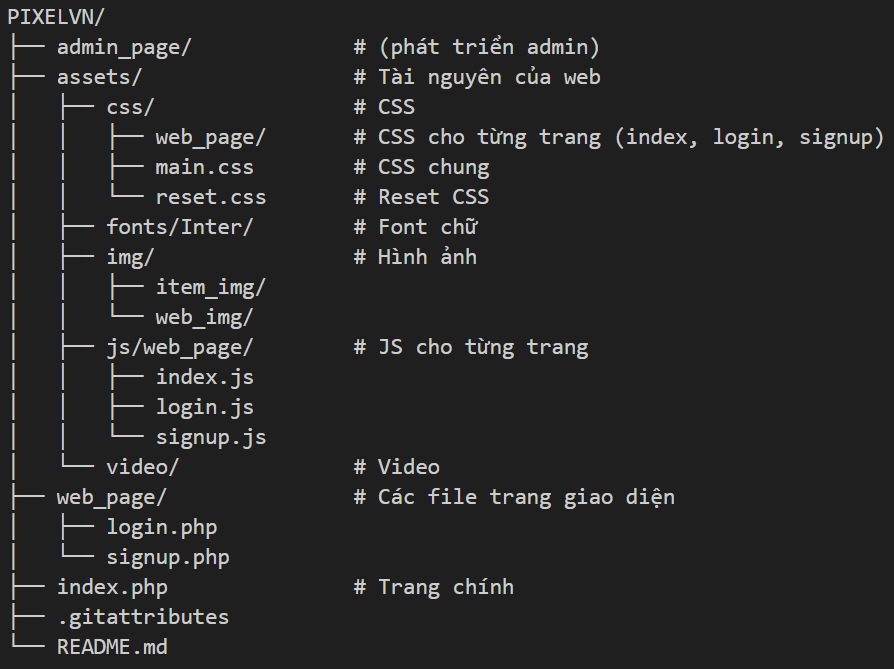

# 🎮 PixelVN Game Stores (v0.1)

PixelVN Game Stores là một website chia sẻ và giới thiệu game dành cho cộng đồng game thủ Việt Nam.  
Phiên bản 0.1 là bản đầu tiên, mới có giao diện cơ bản và một số chức năng demo.

---

## 🚀 Cách chạy dự án

1. Clone project về:
   ```sh
   git clone https://github.com/ThanhPham2k5/pixelvn.git
2. Đặt folder vào htdocs (nếu dùng XAMPP) hoặc thư mục web server của bạn.

3. Mở trình duyệt và truy cập: http://localhost/pixelvn/

---

## ✨ Tính năng hiện tại (v0.1)

1. Trang chủ giới thiệu

2. Form đăng ký / đăng nhập cơ bản

---

## 🛠 Công nghệ sử dụng

- Frontend: HTML, CSS, JavaScript

- Backend: PHP

- Khác: chưa có database, chỉ xử lý cơ bản

---

## 📂 Cấu trúc thư mục



---

## 📌 Ghi chú

Đây mới là phiên bản 0.1 (chưa hoàn chỉnh).
Sẽ cập nhật thêm: quản lý game, đăng bài, hệ thống user,...

---

## 📜 License

Dự án phát hành theo giấy phép MIT.